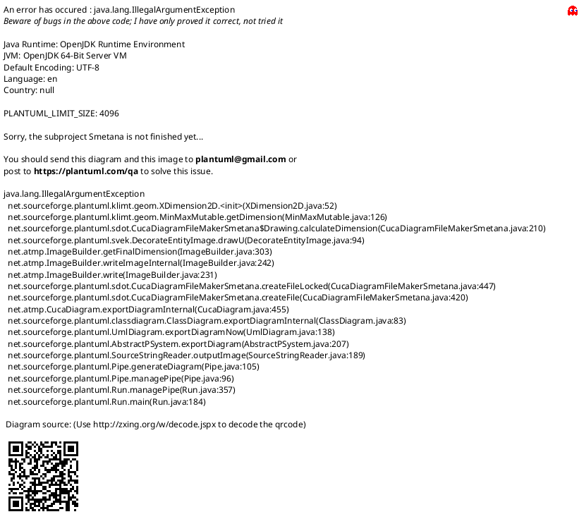

# PlantUML 合同

- 唯一建模语言是 PlantUML。顶层 `.arch-lens/diagrams/**/*.puml` 保存已批准模型；活动 Change Pack 的 `diagrams/**/*.puml` 只保存 add/modify 候选 overlay。
- PlantUML 是唯一可编辑业务模型。SVG 是临时视觉审查材料，可以由 CLI 清理和重建，不进入批准摘要。
- add/modify 候选的相对路径必须与 canonical 路径一致；delete 只在 change.yaml 声明，不保留候选 `.puml` 或 SVG。
- 每个 `.puml` 必须自包含，并使用文件头部的 `arch-lens: type` 和 `arch-lens: question` 元数据。

## 必需元数据



`type` 使用：`use-case`、`domain`、`activity`、`sequence`、`component`、`state`。`question` 必须是一句能由该图回答的问题。标题不得用 `Candidate`、`Draft`、`Approved` 标记图自身的工作流阶段；候选与正式状态由目录位置和批准记录表达。

## 稳定文本规则

- 每行只表达一个元素、关系或消息，便于文本审查。
- 为反复引用或名称较长的元素提供稳定 alias。
- 按阅读顺序组织声明，不为了渲染位置大幅重排源码。
- 样式保持克制；共享布局片段不得替代自包含规则。
- 不使用布局坐标、生成时间、随机 ID 或工具私有元数据。

## Note 预算事实

- source facts 报告 `noteCount`、`noteLineCount`、`noteLineShare`、`maxNoteContentLines` 和 `maxNoteCharacters`。
- 类型预算：`domain`、`sequence`、`use-case`、`activity`、`component` 最多 3 条；`state` 最多 2 条。单条 note 最多 3 行内容或 120 个字符；`noteLineShare > 10%` 产生风险 warning。
- `NOTE_BUDGET_EXCEEDED`、`NOTE_TOO_LONG`、`NOTE_LINE_SHARE_HIGH` 都是 warning。它们只报告确定性事实，语义取舍仍由 Skill 和人类完成。

## 离线安全

- 禁止所有 `!include` 变体、`!includeurl`、`!import`、`!pragma includePath`、URL、file URI 和外部图片。
- 拒绝符号链接，避免图集读取工作区外内容。
- PlantUML 子进程只通过 stdin 接收模型，并强制使用 `SANDBOX` 与 headless。
- 正常检查和渲染把稳定排序的自包含图拼为一次性 stdin 流，在版本门禁后各使用一次批处理 JVM；失败时才回退到 headless 单图诊断。
- `init` 校验 Java 21+，并把固定版本和摘要的官方 PlantUML JAR 安装到用户缓存。
- 候选 SVG freshness 和视觉门禁必须使用锁定受管运行时；显式 `ARCH_LENS_PLANTUML` 或 PATH fallback 只可用于非门禁检查或用户指定导出。

## 检查与渲染

```sh
arch-lens diagrams list
arch-lens diagrams check
arch-lens diagrams render
arch-lens change render <id>
```

- `diagrams check` 只检查源文件、离线安全、语法和 facts，不要求 canonical SVG 缓存。
- `diagrams render` 是可选预览缓存；输出默认写 `.arch-lens/rendered/`，也可以使用 `--output`。
- `change render <id>` 原子刷新 Change Pack 的候选 SVG，供逐图视觉审查。
- SVG 输出及其真实路径不得位于 diagrams 源目录内；符号链接不得绕过边界。

CLI 为 SVG 报告 SHA-256、viewBox、width、height、aspect ratio 和稳定风险诊断。缺失尺寸或非正尺寸是错误，极端宽高比是 warning。CLI 不据此声称语义或审美正确。
