# PlantUML 图集合同

## 文件和真相

- 唯一建模语言是 PlantUML。顶层 `.arch-lens/diagrams/**/*.puml` 保存已批准模型并提交 Git；活动 Change Pack 的 `diagrams/**/*.puml` 只保存 add/modify 候选 overlay。
- 每个 `.puml` 文件只包含一个 `@startuml` / `@enduml` 图。
- 每个 `.puml` 必须自包含。禁止 `.iuml`、`!include`、标准库和其他外部片段，避免形成隐藏的第二类建模真相。
- SVG、PNG、PDF、IDE 预览和 CI 制品均为可再生成视图。SVG 只在显式 render 时写入与源图同层级的 `rendered/` 镜像，由 `init` 加入 `.gitignore`，不得加入 Git；IDE 直接预览不要求生成 SVG。
- 文件按业务能力或用例组织，例如 `scheduling/submit-schedule.sequence.puml`，不用 `frontend/`、`backend/` 作为默认分类。
- add/modify 候选的 Change Pack 相对路径必须与 canonical 路径一致；delete 不创建候选文件。多个活动变更不得同时声明同一 canonical 路径。

## 必需元数据

每个图在开头声明：

```plantuml
@startuml
' arch-lens: type=sequence
' arch-lens: question=提交排程时，哪些职责共同保证手术间不冲突？
title 提交排程 - 正常场景
' 对需要图布局引擎的图，可使用 PlantUML 内置 Smetana，减少 Graphviz 依赖：
!pragma layout smetana
...
@enduml
```



`type` 使用：`use-case`、`domain`、`activity`、`sequence`、`component`、`state`。`question` 必须是一句能由该图回答的问题。`title` 只描述问题或主题，不得用 `Candidate`、`Draft`、`Approved` 等词标记图自身的工作流阶段；候选与正式状态只由目录位置和批准记录表达。图中仍可在确有需要时讨论“候选设计”等工作流概念。

## 稳定文本规则

- 每行只表达一个元素、关系或消息，方便 Git review。
- 为反复引用或名称较长的元素提供稳定 alias；重命名显示名称时尽量保留 alias。
- 按阅读顺序组织声明。不要仅为了渲染位置大幅重排源码。
- 样式保持克制；优先使用 PlantUML 默认样式。确需局部样式时直接写在该图中，不抽取共享片段。
- 用例、领域类和组件图可优先尝试 `!pragma layout smetana` 使用 PlantUML 内置布局；若图种或语法不受支持，再显式安装 Graphviz。
- 不使用布局坐标、生成时间、随机 ID 或工具私有元数据。
- 只使用 PlantUML 官方语法；避免依赖特定 IDE 插件的扩展。

## 离线安全规则

Arch Lens 永不把私有模型上传到远程渲染服务。CLI：

- 禁止所有 `!include` 变体、`!includeurl`、`!import`、`!pragma includePath`、URL、file URI 和外部图片。
- 拒绝符号链接，避免图集在不明显的位置读取仓库外内容。
- PlantUML 子进程只通过 stdin 接收模型，并强制使用 `SANDBOX`，不允许读取任何本地或远程资源。
- 所有 PlantUML 调用强制使用 headless 模式；JAR 入口同时设置 `-Djava.awt.headless=true`，不得在 macOS 或其他桌面环境激活前台 Java 应用。
- 正常检查和渲染把稳定排序的自包含图拼为一次性 stdin 流，在版本门禁后各使用一次批处理 JVM；批次失败时才回退到 headless 单图诊断，且不得部分写入 SVG。
- PlantUML 必须达到 Arch Lens 声明的最低版本；版本过旧或无法识别时拒绝运行。
- `init` 校验 Java 21+，并把固定版本和摘要的官方 PlantUML JAR 安装到用户缓存。运行时解析顺序为显式 `ARCH_LENS_PLANTUML`、有效受管 JAR、PATH PlantUML。

## 检查和渲染

```sh
arch-lens diagrams list
arch-lens diagrams check
arch-lens diagrams render
```

架构敏感变更使用 `arch-lens change diff <id>` 获取不落盘的文本差异。需要 SVG 时分别运行 `diagrams render` 与 `change render <id>`；前者镜像已批准图集，后者镜像候选 overlay，均不创建 base/candidate 子目录。

省略 `--output` 时，顶层 SVG 固定生成到 Git 根目录下的 `.arch-lens/rendered/`。完整 render 原子替换镜像并清除陈旧 SVG；validate、diff 和 init 不创建 rendered。渲染输出及其真实路径不得位于 diagrams 源目录内；符号链接不得绕过该边界。

编辑器实时预览可以使用本机 PlantUML CLI、VS Code/JetBrains 插件或本地 PlantUML server；处理私有仓库时不要使用公共在线 server。
